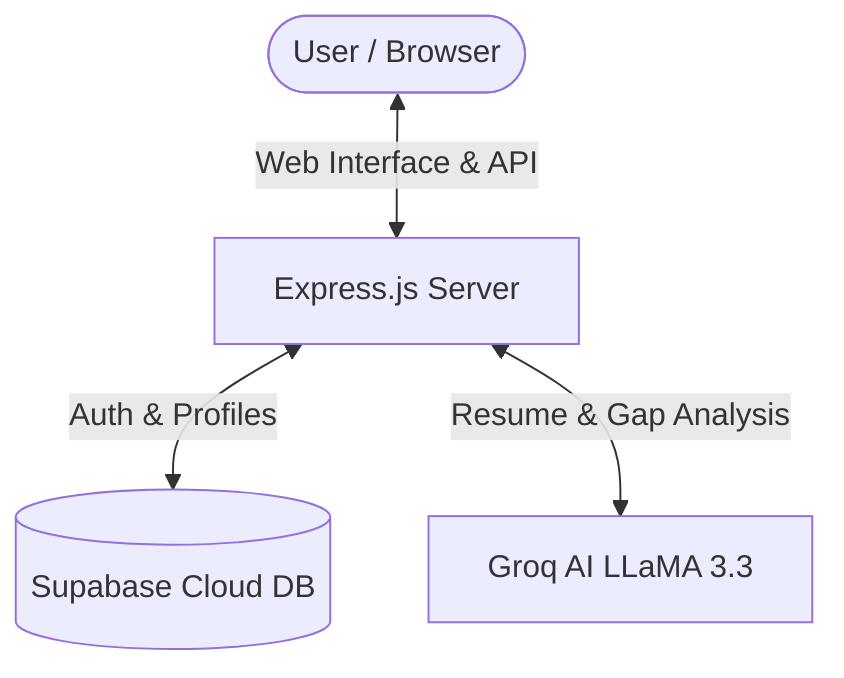

# SkillBridge AI 🚀

> **AI-Powered Career Readiness & Skill Verification Platform**  
> Bridge the gap between education and industry expectations with intelligent skill assessments, AI resume analysis, and dynamic learning roadmaps.

[](https://skillbridge-iml8.onrender.com/)
[](https://github.com/yaminijairaj/SkillBridge)
[-f55036?style=for-the-badge)](https://groq.com)
[](https://supabase.com)
[](https://nodejs.org)

🌐 **Live Application:** [https://skillbridge-iml8.onrender.com/](https://skillbridge-iml8.onrender.com/)

---

## 🌟 Overview

**SkillBridge AI** helps students and aspiring developers evaluate their current technical skill sets against real-world job roles. Using intelligent AI extraction and verification workflows, the platform identifies missing technical requirements, offers tailored roadmaps with vetted resources, tests knowledge through proctored assessments, and provides educators with actionable batch analytics.

---

## ✨ Key Features

- 📄 **Smart Resume Analysis**: Upload resumes (PDF, DOCX, or TXT) to automatically extract core technical skills and tools via Groq AI (LLaMA 3.3 70B).
- 🎯 **Skill Gap Analysis**: Compares a user's skills against real industry roles (Frontend, Backend, AI Engineer, Mobile App Developer, Data Analyst) and calculates a role match percentage.
- 🗺️ **Personalized Learning Roadmaps**: Generates modular, weekly roadmaps with direct links to official documentation, courses, and interactive practice.
- 📝 **Proctored AI Assessments**: Real-time adaptive technical and aptitude quizzes equipped with tab-switch warnings and integrity monitoring.
- 📊 **Educator Dashboard**: Comprehensive analytics portal allowing educators to inspect class-wide skill distributions, student readiness, and test performance.
- 📜 **Verifiable Certificates**: Auto-generates downloadable completion certificates upon passing skill evaluations.

---

## 🛠️ Architecture & Tech Stack



- **Frontend**: Vanilla JavaScript (ES6+), HTML5, CSS3, Boxicons, Canvas API (Certificates)
- **Backend**: Node.js, Express.js, Multer
- **AI / LLM Engine**: Groq Cloud SDK (`llama-3.3-70b-versatile`)
- **Document Parsers**: `pdf-parse`, `mammoth` (Word .docx)
- **Database & Auth**: Supabase (PostgreSQL with real-time support)
- **Hosting & Deployment**: Render ([skillbridge-iml8.onrender.com](https://skillbridge-iml8.onrender.com/))

---

## 📁 Project Structure

```text
SkillBridge/
├── index.html              # Main application single-page interface
├── style.css               # Design system, glassmorphism, responsive styles
├── dummy_resume.txt        # Sample resume file for quick testing
├── js/
│   ├── app.js              # Application bootstrapping
│   ├── api.js              # Client-side API interactions
│   ├── main.js             # Event listeners, flow orchestration, navigation
│   ├── ui.js               # UI render functions & Educator view
│   ├── state.js            # Reactive application state
│   ├── supabase.js         # Supabase client setup
│   ├── certificate.js      # Canvas-based certificate rendering
│   ├── originality.js      # Integrity & proctoring logic
│   ├── challenges.js       # Interactive challenges
│   ├── editor.js           # Code playground & editor tools
│   ├── monitor.js          # Activity & test monitoring
│   └── timer.js            # Quiz timers & interval handlers
└── server/
    ├── server.js           # REST API & static file server
    ├── db.js               # DB configuration
    ├── package.json        # Server dependencies
    └── .env.example        # Environment variable template
```

---


## 🤝 Contributing

Contributions, issues, and feature requests are welcome!  
Feel free to open an issue or submit a pull request to help improve the platform.

---

## 📄 License

This project is licensed under the [MIT License](LICENSE).
